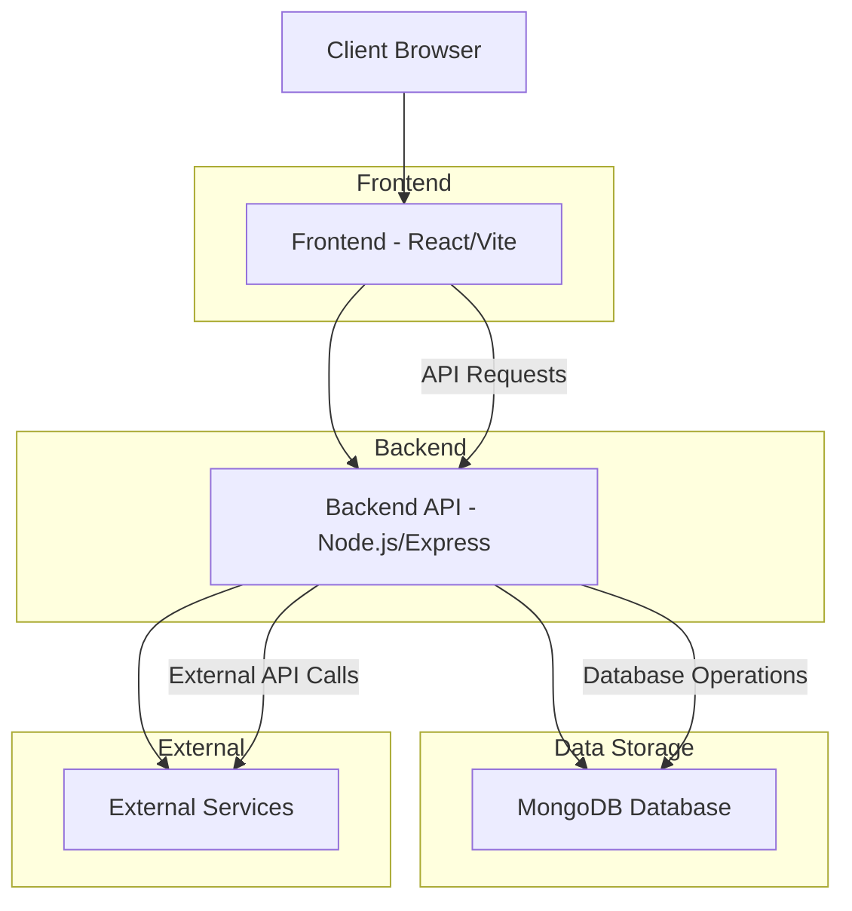

# Application Architecture

## Component Overview

### Frontend (React/Vite)
- **Framework**: React with Vite for fast development
- **Routing**: React Router for client-side navigation
- **Internationalization**: i18next for multilingual support (EN, RU, TG)
- **State Management**: React hooks for local state management
- **API Communication**: Fetch API for backend communication
- **Styling**: CSS Modules for component-scoped styling

### Backend (Node.js/Express)
- **Framework**: Express.js for RESTful API
- **Database**: MongoDB with Mongoose ODM
- **Authentication**: JWT-based authentication (planned)
- **Middleware**: CORS, JSON parsing, error handling
- **API Endpoints**: 
  - Lead management
  - Partner inquiries
  - Parts inquiries
  - Vehicle quote requests

### Database (MongoDB)
- **Collections**:
  - Leads: Customer inquiries and contact forms
  - Partners: Partner inquiry forms
  - Users: Admin users (planned)
  - Vehicles: Vehicle catalog (planned)
  - Parts: Spare parts catalog (planned)

### Deployment
- **Containerization**: Docker for both frontend and backend
- **Orchestration**: Docker Compose for multi-container setup
- **Reverse Proxy**: Nginx for serving frontend and proxying API requests
- **Database**: MongoDB container for data persistence

## Data Flow

1. **User Access**: Client accesses frontend through browser
2. **Frontend Rendering**: React renders UI components based on route
3. **User Interaction**: User interacts with forms, buttons, etc.
4. **API Requests**: Frontend sends requests to backend API
5. **Backend Processing**: Express processes requests and interacts with MongoDB
6. **Database Operations**: Mongoose performs CRUD operations
7. **Response**: Backend sends JSON responses back to frontend
8. **UI Update**: React updates UI based on API responses

## Security Considerations

- **CORS**: Configured to allow only trusted origins
- **Input Validation**: Backend validates all incoming data
- **Environment Variables**: Sensitive data stored in .env files
- **Rate Limiting**: Planned for API endpoints
- **Authentication**: JWT tokens for protected routes (planned)